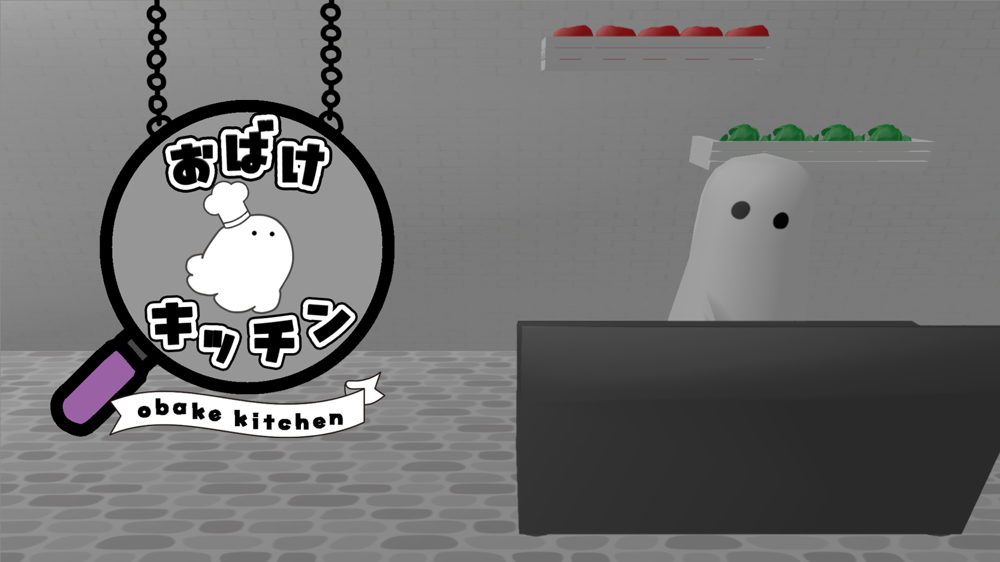
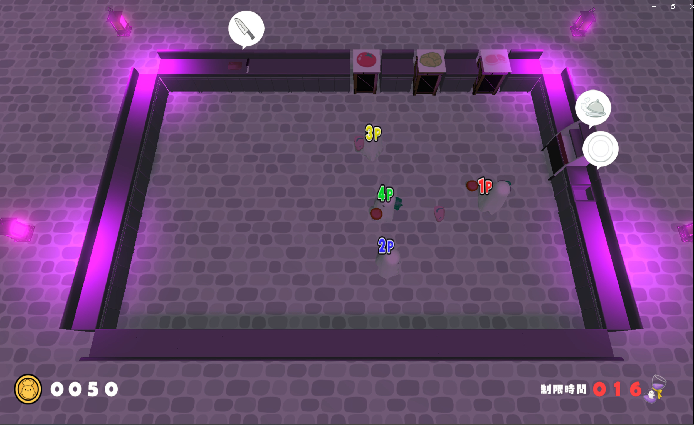
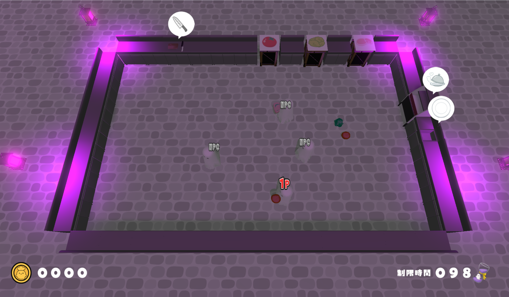
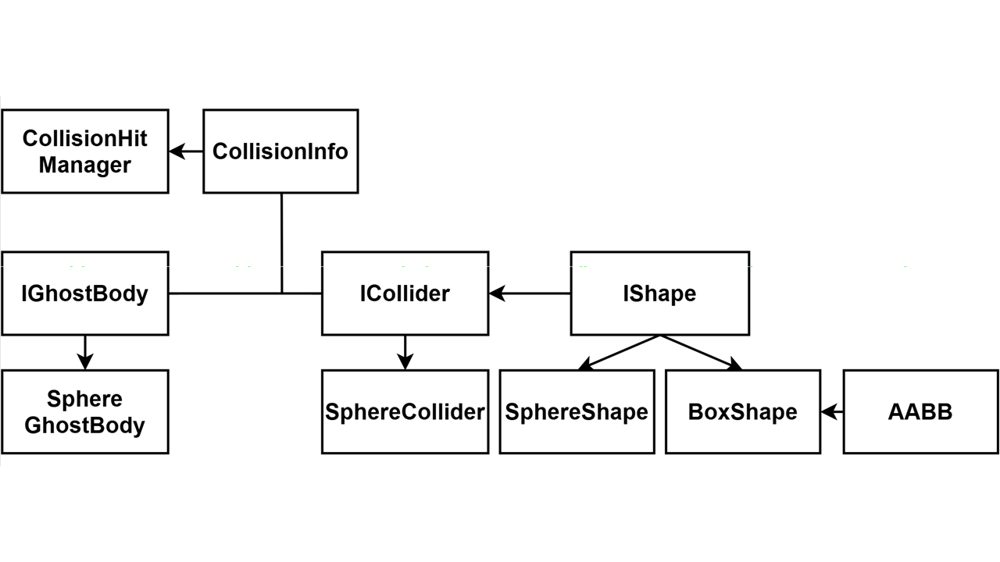

<link rel="stylesheet" href="style.css">

  

# 「おばけキッチン」　ポートフォリオ

## 河原電子ビジネス専門学校　ゲームクリエイター科 27卒

## 氏名：下岡 南

  

 
  ## 👻プレイ動画PV
  youtube : [おばけキッチンPV](https://www.youtube.com/watch?v=fuKsZiqPeCk)
  
---
### 目次
- [「おばけキッチン」　ポートフォリオ](#おばけキッチンポートフォリオ)
  - [河原電子ビジネス専門学校　ゲームクリエイター科 27卒](#河原電子ビジネス専門学校ゲームクリエイター科-27卒)
  - [氏名：下岡 南](#氏名下岡-南)
  - [👻プレイ動画PV](#プレイ動画pv)
    - [目次](#目次)
- [1.作品概要](#1作品概要)
- [2.ゲーム内容](#2ゲーム内容)
  - [3.操作説明](#3操作説明)
  - [4.実装したもの](#4実装したもの)
    - [クラスの設計](#クラスの設計)
      - [4.1 アクターシステムのクラス図](#41-アクターシステムのクラス図)
      - [4.2 シーン管理システム](#42-シーン管理システム)
      - [4.3 プレイヤー操作とステートマシン](#43-プレイヤー操作とステートマシン)
      - [4.4 拡張性の高いUI](#44-拡張性の高いui)
      - [4.5 衝突判定](#45-衝突判定)
      - [4.6 Unityのエディタ拡張](#46-unityのエディタ拡張)
  - [5.まとめ](#5まとめ)
  

# 1.作品概要

- タイトル
    - おばけキッチン
- 学校
    - 河原電子ビジネス専門学校
- 制作人数
    - 1人
- 製作期間
    - 2025年9月~2025年12月(4ヵ月)
- ゲームジャンル
    - 協力型クッキングゲーム
- プレイ人数
    - 1~4人
- 対応ハード
    - PC (Windows 11)
    - Xbox コントローラー
- 使用言語
    - C++
    - C#
- 開発環境
    - エンジン
      - 学校内製エンジン(DirectX12)
    - プログラム
      - Visual Studio 2022
    - ３Dモデル
      - 3ds MAX
    - エフェクト
      - Effeckseer
    - 画像
       - Adobe Photoshop
    - バージョン管理
       - Git Hub
    - タスク管理
       - Notion
    - 配置ツール
       - Unity
- GitHubURL
    -  <a href="https://github.com/shimooka-minami/ObakeKitchen" target="_blank">https://github.com/shimooka-minami/ObakeKitchen</a>

  

---

# 2.ゲーム内容

１人から最大４人で遊べるわちゃわちゃ協力クッキングゲーム。 

たくさん来る注文された料理を完成させよう！ 

お邪魔してくるいじわるなおばけもいるよ👻 

<4人で遊んだ場合：1～4P> 

 

<1人で遊んだ場合：1P + NPC 3体> 

  

---

## 3.操作説明

  

- Aボタン：拾う・置く

- Bボタン：走る

- Xボタン：投げる・切る

- 左スティック：移動

  

  

---

  

## 4.実装したもの

### クラスの設計

 ゲーム内のあらゆるオブジェクトを管理しやすくするために、しっかりとルールを決めた継承を構築しています。 

 これによって、共通処理(描画、座標変更、衝突判定など)のコードの重複をさせず、新しいギミックやUIの追加を簡単にしています。

#### 4.1 アクターシステムのクラス図

 ゲーム内の動的オブジェクトはすべてActorクラスを基底としています。 

  

 Actor：位置情報(Transform)や当たり判定(Collider)を持つ基底クラス 

 Character：ステートマシンを持ち、移動やアクションを行う動的な存在 

 Gimmick：プレイヤーが動かすこと(Interact)可能な固定オブジェクトたち 

  

 

  

#### 4.2 シーン管理システム

 IScene(基底クラス)に各ゲーム画面(タイトル、ゲーム、リザルト)のインターフェースを実装しており、SceneMangerによってまとめて動きを管理しています。 

  

  

#### 4.3 プレイヤー操作とステートマシン

 プレイヤー操作を「コントローラー入力・AIの行動」と「アクションの実行」を分けています。 

 PlayerControllerもしくはNPCControllerが入力を取得し、共通のStateMachineがそれぞれの行動を受け取って状態の遷移を行います。 

 これによって、プレイヤーとNPC(AI)が同じように動くようにしました。 

  

⭐AIの実装時にキャラクター自体の行動を変更する必要がなくなる

　　→デバックや拡張がしやすくなった！

  

実装：PlayerStateを通して、待機・歩き・走る・料理などの状態をクラス化し、自由に切り替えができます。

  

#### 4.4 拡張性の高いUI

 UI要素もゲームオブジェクトと同様にUIBaseを基底とした継承を行っています。 

 これにより、UIアニメーションやUI表示の制御を管理しています。 

 また、UIを描くための下敷きとしてキャンバスを作成しています。 

 キャンバスを移動すると関連するUIも一緒に移動するため、アニメーションなどの演出面ですべてのUIにそれぞれ処理を追加する必要がなくなります。 

 ⭐キャンバスのみの適用で簡単にUIが追加できる！

  

UIInteractIcon：プレイヤーがギミックに近づいたときに表示されるアイコン 

UIScore / UITimer：ゲームの進行状況を反映するUI 

Canvas：UI作成時の下敷き。Canvas内での位置変更等もできる 

  

  

#### 4.5 衝突判定

 ColliderとCollisionManagerにより、物理的な動きを管理しています。 

 GhostBody：物理的な判定はないが、透明な判定のみを検知します。 

   →例)キッチンのまな板の前に立つと「食材を切る」判定を行う

  

  

GhostBodyクラス（IGhostBodyクラス・SphereGhostBodyクラス） 

・役割：ゲームオブジェクト（Playerなど）と、当たり判定機能（Collider）をつなぎます。 

・詳細：物理的な物体ではない当たり判定を担当するクラス。 

　　　　（跳ね返ったりしない、センサーのような判定） 

　　　　自分がどのキャラクターに紐づいているか（m_owner）を管理しています。 

  

Colliderクラス（IColliderクラス・SphereColliderクラス） 

・役割：実際に、当たったかどうかを計算する判定を処理しています。 

・詳細：IsHit()という関数を持っており、数学的な計算（球体と球体が重なっているか など）を行っています。 

  

Shapeクラス（IShapeクラス・SphereShapeクラス・BoxShapeクラス・AABBクラス） 

・役割：半径や幅といった「形状データ」の定義。 

・詳細：計算などの機能は持たず、「球体なら半径（radius）」「箱ならサイズ（AABB）」といった形ごとのデータだけを持っています。 

  

⭐なぜ、この設計にしたのか？ 

・失敗談 

　　過去の制作では、PlayerクラスでEnemyとの当たり判定をしていました。 

　　これだと、PlayerがEnemyに依存してしまっています。 

　　知らなくてもいいことも知っている状態なので、変更するとエラーになってしまうなどの問題がありました。 

・失敗からの学び 

　　知らなくてもいいことは、知らない状態にしたかったので、 

　　PlayerでもEnemyでも何でも知っているCollision専用のスーパークラスとしてCollisionManagerクラスを作りました。 

　　逆に考えると、それぞれが知らなくても良いような作りに強制的にすることができます。 

  

⭐なぜ、コリジョン処理を自作したのか？ 

・失敗談 

　　コリジョンの処理には「BulletPysics」という、多機能な処理が詰め込まれたものを使っていました。 

　　これは、多機能ゆえに当たり判定の処理をしたいのに、色々な処理も走っているため、処理の負荷が重くなりました。 

　　（例：球体とBoxの判定処理をすると、指定しても当たり判定の対象をさがす処理が走っていた。） 

・失敗からの学び 

　　あまりにも処理が重すぎたので、シンプルに球体同士の当たり判定で良かったので自作しました。 

　　対象同士の判定を、自分で書くことで無駄な処理が走らなくなり、負荷を減らすことができました。 

  
  

  
  
  
  

#### 4.6 Unityのエディタ拡張

 Unityエディタをステージの配置ツールとして使っています。 

 Unity上でオブジェクトを配置したり、ゴーストインタラクト判定の設定を行い、その内容をJsonファイルで書き出しています。 

 書き出したJsonファイルを内製エンジンに読み込むことで、Unityで配置した見た目通りのステージがそのままゲーム内に表示されます。 

⭐Unity内で画面を見ながら直感的にステージが作れる！ 

  

---

## 5.まとめ

 今回の制作では、ゲームとして動くことだけでなく 「保守性」　「拡張性」　「パフォーマンスの向上」の3つに重点を置き、実践の場として開発しました。 

 オブジェクト指向設計を意識し、機能の追加(新しい調理器具やステージの追加など)にも対応できるようにしています。 

